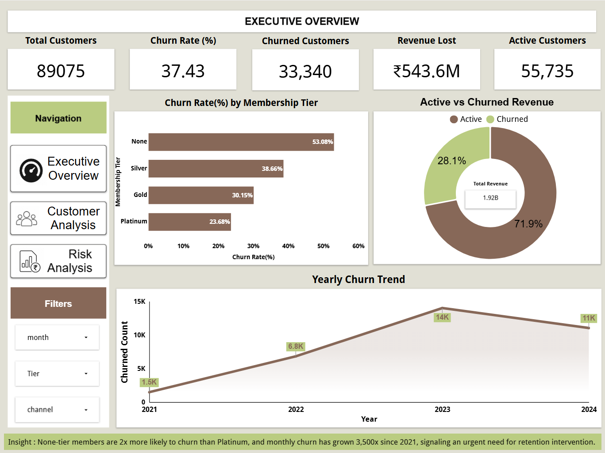
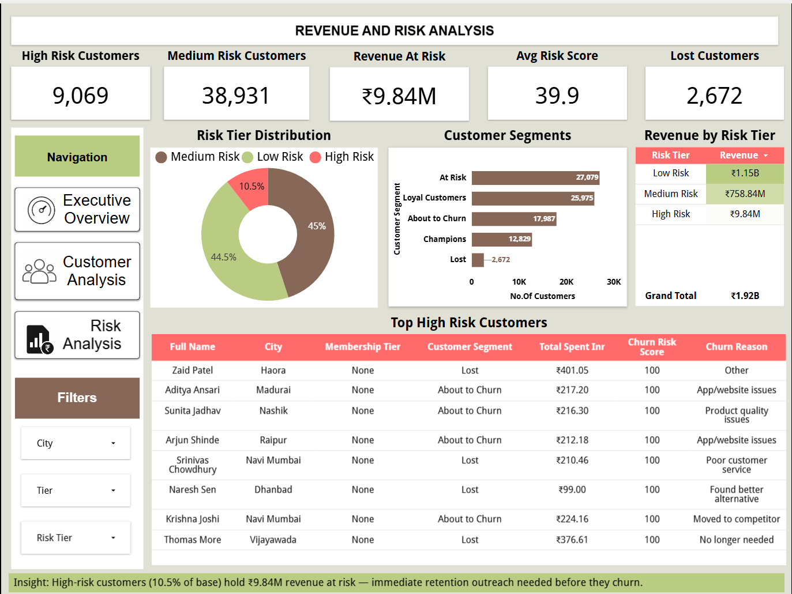

# 🛒 E-Commerce Customer Churn Analysis
**Tools:** BigQuery · SQL · Looker Studio · Google Cloud Platform

---

## 📊 Live Dashboard
🔗 **[Click here to view Live Dashboard](https://datastudio.google.com/reporting/aaa25d00-0e9b-4db2-867e-b3bb14ed35dd)**

---

## 📌 Project Overview
End-to-end churn analysis on **1,05,000 realistic Indian 
e-commerce customer records**. Built entirely with SQL 
Covers data exploration, cleaning, 5-layer deep analysis, 
RFM-based risk scoring, and a 3-page interactive dashboard.

---

## 🖼️ Dashboard Preview

### Page 1 — Executive Overview

### Page 2 — Customer & Behavior Analysis

### Page 3 — Revenue & Risk Analysis

---

## 🔑 Key Findings

| Finding | Insight |
|---------|---------|
| Overall Churn Rate | 37.43% of 89,075 customers churned |
| Revenue Lost | ₹543.6M lost to churned customers |
| Recency Impact | 365+ day inactive customers churn at 54.48% vs 16.47% |
| Membership Impact | None-tier members churn at 53% vs 23.68% for Platinum |
| High Risk Customers | 9,069 customers holding ₹9.84M at immediate risk |
| Churn Growth | Grew from 1.5K (2021) to 14K (2023) — 9x increase |

---

## 🗂️ Dataset
- **Size:** 1,05,000 rows · 34 columns
- **Period:** January 2021 – June 2024
- **Churn Rate:** 37.43%
- **Source:** Synthetically generated realistic Indian ecommerce data

### Data Quality Issues Fixed
| Issue | Count |
|-------|-------|
| Null/invalid emails | ~2,400 |
| Invalid ages | ~500 |
| Negative spend values | ~182 |
| Membership typos (Sivler, G0ld) | ~3% rows |
| Impossible returns > orders | ~1,050 |
| Future signup dates | 50 rows |
| Duplicate records | ~1,575 |
| Mixed gender formats (M,F,0,1) | ~2,000 |

---

## 📁 Project Structure
